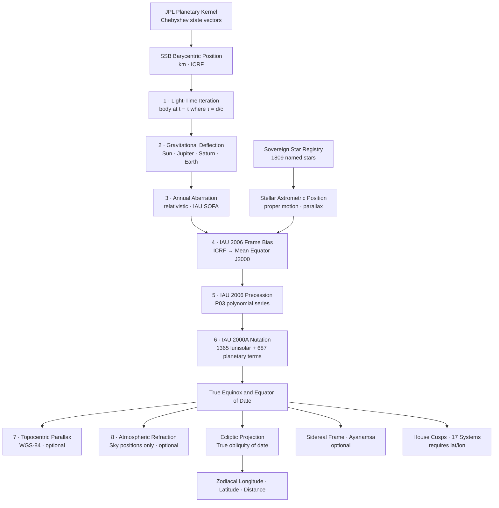

# Moira

**Pure-Python Ephemeris and Astrology Computation Engine**

[](https://www.python.org/downloads/)
[](https://opensource.org/licenses/MIT)
[](https://pypi.org/project/moira-astro/)
[](#validation-evidence)
[](https://naif.jpl.nasa.gov/naif/index.html)
[](#requirements-and-installation)

Moira is an astronomy-first astrology engine: a pure-Python ephemeris engine and astrology computation engine built for transparent astrology calculations, reproducible chart computation, and an inspectable calculation chain from astronomical inputs to astrological outputs. It is an auditable astrology engine with explicit computational policy, deterministic behavior, and readable reduction stages grounded in modern standards and references including JPL DE441, IAU 2000A/2006, ERFA/SOFA-aligned practices, and Gaia DR3-linked star data where applicable.

## Why Moira Exists

Most astrology software surfaces results without exposing the mathematical path. Moira exists as a Swiss Ephemeris alternative for users who need visibility into assumptions, intermediates, and provenance, so astronomy remains the foundation and astrology remains the purpose.

## What Makes It Different

Moira is designed for full computational transparency: core transformations are implemented in inspectable Python, computational doctrine is explicit rather than hidden in defaults, and validation is treated as first-class evidence rather than post-hoc narrative.

## Who It Is For

Moira is for developers, researchers, and serious practitioners who want a programmable, audit-ready engine for high-integrity astrological work, reproducible pipelines, and methodical comparison against external authorities.

## What It Is Not

Moira is not primarily a UI app, not a thin wrapper over opaque compiled stacks, and not convenience-first astrology output generation without traceability.

## Quick Capabilities

Moira computes planetary and stellar positions, houses, aspects, lots, dignities, predictive techniques, eclipse and occultation events, and related analytical products on top of a modern astronomical substrate (JPL kernels, IAU models, and validated star frameworks), with pure-Python execution and inspectable intermediate stages.

---

## What Moira Computes

### Positions and Bodies

- **Planets and luminaries** — geocentric and topocentric reduction with iterative light-time, annual aberration, multi-body relativistic deflection (Sun, Jupiter, Saturn, Earth), IAU 2006 frame bias, and WGS-84 topocentric parallax.
- **Fixed stars** — sovereign registry of 1,809 named stars with proper motion, parallax, epoch propagation, and Stellar Quality classification. Audited anchor residual against SOFA/ERFA: 0.00048 arcseconds (J1000–J3000).
- **Asteroid fleet** — dedicated engines for classical asteroids (Ceres, Pallas, Juno, Vesta), Centaurs (Chiron, Pholus, Chariklo, Asbolus, Hylonome), and Trans-Neptunians (Ixion, Quaoar, Varuna, Orcus) via bundled SPK kernels. User-supplied `.bsp` kernels supported via the integrated `daf_writer` for any of the 887,000+ numbered minor planets in the JPL catalog.
- **Uranian / Hamburg School bodies** — 8 hypothetical transneptunian planets (Cupido through Poseidon) plus Transpluto.
- **Lunar nodes and apsides** — True Node, Mean Node, Mean Lilith, True Lilith, and orbital nodes/apsides for all planetary bodies.
- **Variable stars** — phase and magnitude engine for eclipsing binaries and intrinsic variables; dedicated Algol API.
- **Multiple star systems** — Kepler orbital mechanics for visually resolvable pairs (Sirius AB, Alpha Centauri AB); catalog of 8 astrologically significant systems across VISUAL, WIDE, SPECTROSCOPIC, and OPTICAL types.

### Chart Calculation

- **House systems** — 17 systems including Placidus, Koch, Regiomontanus, Campanus, Morinus, Porphyry, Whole Sign, Equal, APC, and Sunshine.
- **Aspects** — 22 zodiacal aspects with applying/separating/stationary motion-state detection; declination parallels and contra-parallels; antiscia and contra-antiscia.
- **Aspect patterns** — 21 multi-body configurations: T-Square, Grand Trine, Grand Cross, Yod, Kite, Mystic Rectangle, Stellium, Grand Sextile, Thor's Hammer, Boomerang Yod, and more.
- **Midpoints** — full midpoint matrix, midpoint trees, 90°/45°/22.5° dial projections, planetary pictures.
- **Traditional dignities** — domicile, exaltation, triplicity (diurnal/nocturnal), Egyptian and Ptolemaic terms, face, sect, hayz, and Almuten Figuris.
- **Arabic Parts** — 499 lots with dependency graphs and condition profiling.
- **Hermetic decans** — 36-decan system with computed positions for all ruling stars.

### Predictive Techniques

- **Progressions** — secondary, tertiary, minor, solar arc (longitude and right ascension), Naibod, ascendant arc; direct and converse variants for all methods.
- **Primary directions** — Placidus semi-arc and mundane; speculum computation; fixed-star targets.
- **Returns** — solar and lunar returns; planet returns.
- **Time lords** — annual and monthly profections; Firdaria (diurnal and nocturnal sequences, including Bonatti variant); Zodiacal Releasing (Vettius Valens method); Hyleg and Alcocoden.
- **Vedic techniques** — Vimshottari Dasha with nakshatra balance; sidereal positions; 27 nakshatra system; Varga/divisional charts (navamsa, dashamansa, dwadashamsa, saptamsa, trimshamsa).

### Advanced Astronomy

- **Eclipses** — NASA-canon contact solver for solar and lunar eclipses; Saros series classification with heptagonal vertex labelling; local circumstance computation.
- **Heliacal phenomena** — heliacal rising and setting; acronychal rising and setting; planetary elongation extremes.
- **Parans** — paranatellonta field analysis with contour extraction and stability metrics.
- **Occultations** — lunar occultation of stars and planets; close-approach detection.
- **Stations** — retrograde stations with precise stationary-point search.
- **Mapping** — Astrocartography (ACG) lines for all planets; Local Space chart positions; Gauquelin sectors.
- **Galactic coordinates** — full equatorial-to-galactic transform and reference point catalog.
- **Temporal systems** — 28-mansion Arabic lunar stations (Manazil); Sothic cycle drift and Egyptian civil calendar conversion; void-of-course Moon windows.
- **Harmonics** — harmonic chart calculation, aspect-harmonic profiles, vibrational fingerprint analysis.
- **Synastry** — inter-chart aspects, house overlays, composite chart (midpoint method), Davison chart (spherical midpoint).
- **Jones chart shapes** — all 7 temperament types.

---

## Quick Start

Moira initializes even when no planetary kernel is present. Kernel-dependent operations (for example `chart()`) raise a clear `MissingEphemerisKernelError` until a kernel is configured. See [Kernel Setup](#kernel-setup) below before executing planetary examples.

```python
from datetime import datetime, timezone
from moira import Moira

m = Moira()

# 1. Planetary positions
chart = m.chart(datetime(2000, 1, 1, 12, 0, tzinfo=timezone.utc))
print(f"Sun:  {chart.planets['Sun'].longitude:.6f} deg")
print(f"Moon: {chart.planets['Moon'].longitude:.6f} deg")

# 2. House cusps (Placidus, London)
from moira import HouseSystem
houses = m.houses(
    datetime(2000, 1, 1, 12, 0, tzinfo=timezone.utc),
    latitude=51.5074,
    longitude=-0.1278,
    system=HouseSystem.PLACIDUS,
)
print(f"ASC: {houses.asc:.4f} deg  |  MC: {houses.mc:.4f} deg")

# 3. Aspect patterns
from moira.patterns import find_all_patterns
patterns = find_all_patterns(chart.longitudes())
for p in patterns:
    print(f"{p.name}: {', '.join(p.bodies)}")
```

---

## Requirements and Installation

- Python 3.10 or later
- `jplephem >= 2.24` (the only required runtime dependency)
- A JPL DE-series planetary kernel (de430, de440, or de441 — not bundled; see below)

```bash
# Standard install (pure Python)
pip install moira-astro

# With NumPy acceleration for the nutation engine
pip install moira-astro[fast]
```

---

## Kernel Setup

Moira requires a JPL DE-series SPK planetary kernel for all planetary computation. No kernel is bundled — the files are large and the choice of release belongs to the user.

**Supported kernels:**

| Kernel | File | Size | Date range | Notes |
| :--- | :--- | :--- | :--- | :--- |
| DE441 | `de441.bsp` | ~3.1 GB | ~13 200 BCE – ~17 200 CE | Original design target; maximum date coverage |
| DE440 | `de440.bsp` | ~114 MB | 1550 BCE – 2650 CE | Current JPL standard; recommended for most users |
| DE430 | `de430.bsp` | ~128 MB | 1550 BCE – 2650 CE | Widely deployed predecessor to DE440 |

### Kernel Manager (GUI)

The easiest way to download and configure a kernel is the built-in Tkinter interface. It requires no extra dependencies — Tkinter ships with CPython on all platforms.

```bash
moira-kernel-manager
```

The window shows all supported kernels with extended descriptions (design rationale, date coverage, size trade-offs), live Installed/Missing status for each, and a real progress bar for downloads. You can also point Moira at a `.bsp` file already on disk without re-downloading.

What the GUI provides:

- **Kernel list** — planetary (de430, de440, de441) and supplemental (asteroids, small bodies) sections with size, date range, and status per row.
- **Detail panel** — selecting a row shows a full description of that kernel's coverage, accuracy, and when to prefer it over the alternatives.
- **Download with progress** — streams the selected kernel in the background; a progress bar tracks bytes received. A Cancel button interrupts the transfer and removes the partial file.
- **Use selected** — activates an installed kernel for the current session via `set_kernel_path()`.
- **Browse…** — open any `.bsp` file already on disk and set it as the active kernel immediately.

### CLI

```bash
# List all kernels and their status
moira-download-kernels --list

# Download all missing kernels (interactive prompt)
moira-download-kernels

# Download without prompting
moira-download-kernels --yes
```

### Engine readiness model

- `Moira()` succeeds even if no kernel is installed. It auto-discovers any compatible kernel in the standard locations.
- `m.is_kernel_available()` reports kernel readiness.
- `m.get_kernel_status()` explains expected paths and remediation.
- `m.available_kernels` lists all installed compatible kernels.
- Kernel-dependent calls raise `MissingEphemerisKernelError` with instructions.

**Standard location:** `kernels/<filename>.bsp` relative to the repository root, or `~/.moira/kernels/`. The engine resolves either automatically.

**Custom location:** pass the path at construction, or call `set_kernel_path()` before the first `Moira()` instantiation:

```python
from moira.spk_reader import set_kernel_path
from moira import Moira

set_kernel_path("/path/to/de440.bsp")
m = Moira()

print(m.is_kernel_available())
print(m.get_kernel_status())
print(m.available_kernels)
```

**Direct download links (JPL SSD):**

- DE441: [https://ssd.jpl.nasa.gov/ftp/eph/planets/bsp/de441.bsp](https://ssd.jpl.nasa.gov/ftp/eph/planets/bsp/de441.bsp)
- DE440: [https://ssd.jpl.nasa.gov/ftp/eph/planets/bsp/de440.bsp](https://ssd.jpl.nasa.gov/ftp/eph/planets/bsp/de440.bsp)
- DE430: [https://ssd.jpl.nasa.gov/ftp/eph/planets/bsp/de430.bsp](https://ssd.jpl.nasa.gov/ftp/eph/planets/bsp/de430.bsp)

---

## Data Inventory

| Layer | Source | Bundled | Note |
| :--- | :--- | :--- | :--- |
| IAU 2000A/2006 nutation and precession tables | IAU | Yes | 2,414 terms; pure Python |
| DE-series planetary kernel | JPL | No | de430 (~115 MB), de440 (~114 MB), or de441 (~3.3 GB); download separately |
| Named star registry | Sovereign (`star_registry.csv` + JSON provenance) | Yes | 1,809 stars; license-independent |
| Centaur kernel | Moira native | Yes | `centaurs.bsp` — Chiron, Pholus, Chariklo, Asbolus, Hylonome |
| Minor-body kernel | Moira native | Yes | `minor_bodies.bsp` — classical asteroids and select TNOs |

---

## NumPy Acceleration

Moira is functionally identical with or without NumPy. When present, NumPy accelerates the IAU 2000A nutation evaluation from approximately 2.7 ms to 0.035 ms per call — a factor of roughly 79x. Numeric drift from the vectorised path is less than 3×10⁻¹⁶ degrees.

The acceleration matters most in phenomenon-searching loops (retrograde periods, eclipse searches, heliacal events, conjunction sweeps) where nutation is evaluated thousands of times. For single-chart work, the pure-Python path is adequate.

---

## Validation Evidence

Moira is validated as a three-layer corpus. Each layer has its own correct evidence standard.

**Astronomy layer** — authoritative physical oracles first, enforced regression thereafter.
References: IAU ERFA/SOFA, JPL Horizons, NASA catalogs, IERS.

**Astrology layer** — external chart software where stable and meaningful; doctrine-grounded invariants where no universal oracle exists.
References: Swiss Ephemeris, Astro.com, canonical doctrine tables, structural invariants.

**Experimental layer** — subsystem-specific surfaces for sovereign or modern domains.
Domains: sovereign fixed stars, variable stars, multiple star systems, galactic transforms, eclipse Saros classification.

Every validated claim must pass three gates:

1. **Gate of Source** — inputs and reference data are tied to an independent authority.
2. **Gate of Flow** — the computational path is explicit and inspectable.
3. **Gate of Oracle** — outputs are benchmarked against an external reference appropriate to the domain.

When residuals remain, Moira documents them as model-basis differences rather than mislabeling them as engine defects. Two systems may be internally correct while answering different mathematical questions because of differing assumptions — for example, Delta-T branch, retarded-versus-geometric Moon treatment, or event-definition objective.

| Report | Verification Source |
| :--- | :--- |
| [`VALIDATION_ASTRONOMY.md`](wiki/03_validation/VALIDATION_ASTRONOMY.md) | IAU ERFA/SOFA, JPL Horizons, NASA. Geocentric residual: 0.576 arcseconds (documented Delta-T divergence). |
| [`VALIDATION_ASTROLOGY.md`](wiki/03_validation/VALIDATION_ASTROLOGY.md) | Swiss Ephemeris, Astro.com, canonical doctrine tables. Houses, ayanamshas, predictive cycles. |
| [`VALIDATION_EXPERIMENTAL.md`](wiki/03_validation/VALIDATION_EXPERIMENTAL.md) | SOFA/ERFA, Swiss swetest, AAVSO, GCVS, binary orbit ephemerides. Sovereign stars, variable stars, multiple systems. |

---

## The Reduction Pipeline



### Worked Example: Mars at J2000.0

The following traces every pipeline stage for Mars on 2000 January 1, 12:00 TT, using live DE441 kernel data. All numbers are from the running engine.

**Time:** JD_UT 2451545.000000 → JD_TT 2451545.000739 &nbsp;(ΔT = +63.807 s)

| Step | Operation | Vector / Value | Shift from Previous |
| :---: | :--- | :--- | :--- |
| 0 | **DE441 kernel read** — SSB → Mars | (206,980,508.6, −184,891.6, −5,666,529.8) km | — |
| 0 | **DE441 kernel read** — SSB → Earth | (−27,568,641.0, 132,361,060.2, 57,418,514.1) km | — |
| 0 | **Geometric geocentric** — Mars − Earth | distance: 276,697,408.2 km = 1.849608 AU | — |
| 1 | **Light-time iteration** — Mars at t − τ | τ = 0.010683 days = **15.383 min** | **15.761 arcsec** |
| 2 | **Gravitational deflection** — Sun + Jupiter + Saturn | sub-arcsecond bending of light path | **0.006 arcsec** |
| 3 | **Annual aberration** — Earth velocity 29.786 km/s | relativistic displacement toward apex | **14.070 arcsec** |
| 4 | **IAU 2006 frame bias** — ξ₀ = −16.617 mas, dε₀ = −6.819 mas | fixed ICRF → mean equinox J2000 rotation | **0.023 arcsec** |
| 5 | **IAU 2006 precession** — P03 polynomial series | negligible at J2000 (reference epoch) | **0.016 arcsec** |
| 6 | **IAU 2000A nutation** — Δψ = −13.932″, Δε = −5.769″ | true equator and equinox of date | **14.351 arcsec** |
| 7 | **Ecliptic projection** — true obliquity ε = 23.437677° | λ = **327.963300°** · β = −1.067779° · d = 1.849688 AU | — |

**Final position: Aquarius 27° 57′ 48″** &nbsp;·&nbsp; distance 1.8497 AU &nbsp;·&nbsp; speed +0.7757°/day (direct)

**Total pipeline correction from geometric to apparent: −43.760 arcsec**

The largest contributors are nutation (−13.932″), annual aberration (−14.070″), and the combined light-time displacement (−15.761″). Gravitational deflection (0.006″) and frame bias (0.023″) are sub-arcsecond but non-negligible at sub-arcsecond accuracy targets.

### Pipeline Controls

Each correction stage can be toggled independently via `planet_at()`. The table below shows the measurable effect of disabling each stage on the Mars J2000.0 result.

| Parameter | Default | Effect on Mars J2000.0 longitude | Function |
| :--- | :--- | :--- | :--- |
| `apparent=True` | `True` | Full pipeline active | `planet_at()` |
| `apparent=False` | — | Geometric position; all corrections skipped. Δ = **+43.760 arcsec** | `planet_at()` |
| `aberration=False` | — | Aberration stage skipped. Δ = **+14.069 arcsec** | `planet_at()` |
| `grav_deflection=False` | — | Deflection stage skipped. Δ = **+0.003 arcsec** | `planet_at()` |
| `nutation=False` | — | Nutation skipped; mean equinox used. Δ = **+13.932 arcsec** | `planet_at()` |
| `observer_lat/lon` | `None` | When supplied, adds topocentric parallax (WGS-84). Effect: ~1° for Moon, <0.01″ beyond Jupiter | `planet_at()` |
| `refraction=True` | `True` | Atmospheric refraction applied to altitude. Effect: ~0.57° at horizon | `sky_position_at()` |
| `delta_t_policy` | `None` | Controls UT → TT conversion branch (IERS tables, polynomial, hybrid physical) | both |

---

## Project Documentation

The canonical documentation tree lives in `wiki/`. The flat `moira.wiki/` Git wiki mirror is generated from it by `python scripts/sync_git_wiki.py` and should not be edited by hand.

| Document | Contents |
| :--- | :--- |
| [`01_LIGHT_BOX_DOCTRINE.md`](wiki/01_doctrines/01_LIGHT_BOX_DOCTRINE.md) | Transparency and derivation as design constraints. |
| [`BEYOND_SWISS_EPHEMERIS.md`](wiki/01_doctrines/BEYOND_SWISS_EPHEMERIS.md) | Capabilities enabled by sovereign catalogs, explicit policy, and modern Python. |
| [`CONSTITUTIONAL_PROCESS.md`](wiki/00_foundations/CONSTITUTIONAL_PROCESS.md) | The Subsystem Constitutional Process — the development and governance protocol. |
| [`MOIRA_ROADMAP.md`](wiki/06_roadmap/MOIRA_ROADMAP.md) | Feature implementation status and mathematical accuracy register. |

---

## License

MIT (c) 2026 Burkett

