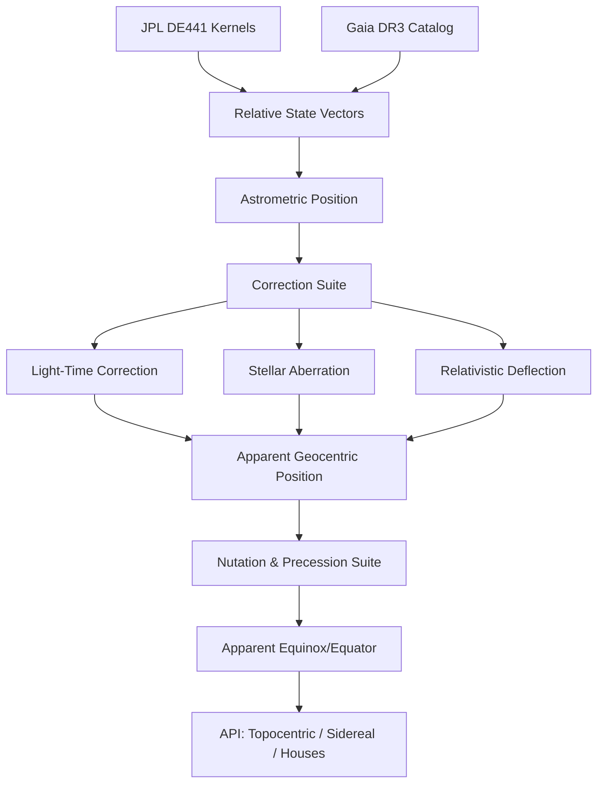

# MOIRA

### The Pure-Python Ephemeris for the 21st Century

[](https://www.python.org/downloads/release/python-3140/)
[](https://opensource.org/licenses/MIT)
[](#validation)
[](https://naif.jpl.nasa.gov/naif/index.html)


> *Moira* — In Greek myth, the goddess who assigns each soul its fate. The one who measures the thread.

Moira is a **Pure-Python** astronomical engine designed for the absolute inversion of the "Black Box" ephemeris standard. By combining **JPL DE441** kernels, **IAU 2000A/2006** reduction suites, and **Gaia DR3** distancing, Moira delivers sub-milliarcsecond precision in an auditable, modern architecture.

---

## The Light Box Manifesto

The era of opaque pre-computation is over. Moira performs **Luminous Derivation**—deriving every coordinate through a visible, auditable logic at runtime.

### The Inversion of the Standard

| Attribute | The Black Box (Legacy) | The Light Box (Moira) |
| :--- | :--- | :--- |
| **Logic Substrate** | Compiled C / Opaque Loops | Pure, Auditable Python 3.14+ |
| **Data Standard** | Proprietary `.se1` Binary Files | Raw **JPL DE441** SPK Kernels |
| **Star Database** | 118K Stars (Hipparcos 1997) | **1.8 Billion** Stars (Gaia DR3 2022) |
| **Precision Anchor** | Software-to-Software Mimicry | **External Physics Oracles (SOFA/ERFA)** |
| **Uncertainty** | Silent Fallbacks | Explicit **Uncertainty Envelopes** |

---

## The Three Gates of Evidence

Every calculation in Moira must pass through the **Three Gates of Evidence** to be considered "Luminous." We don't ask for trust; we provide the evidence.


1.  **Gate of Source**: All raw data can be verified against an independent physical observatory (JPL, NASA, ESA).
2.  **Gate of Flow**: Every transformation (Nutation, Aberration, Light-Time) is readable as code, not hidden in a compiled buffer.
3.  **Gate of Oracle**: Continuous `pytest` suites benchmark every computation against the **IAU SOFA/ERFA** reference routines at sub-milliarcsecond accuracy.

---

## The Case for a New Engine


Since the release of the Swiss Ephemeris in 1997, the astronomical world has shifted. The Hipparcos catalog has been superseded by **Gaia DR3**, providing 3D parallax for billions of stars. Asteroid discovery has exploded from 10,000 to over **887,000+**. 

Legacy data files cannot compute a body they were not pre-built for. They cannot access IERS real-time Earth orientation data. They have no pathway to Gaia parallax. **Moira is built to reach all of these things.**

---

## Architectural Visualization

### The Reduction Pipeline



---

## Features & Capabilities

<details>
<summary><b>Planetary & Minor Body Precision</b></summary>
- Geocentric/Topocentric reduction for all major planets & asteroids.
- 1.4M asteroid support via JPL Horizons API and local SPK kernels.
- Centaur & TNO specialist kernels (Chiron, Eris, Sedna).
- Deep integration of orbital nodes and apsides for all bodies.
</details>

<details>
<summary><b>Chart & Astrological Models</b></summary>
- 18 House Systems including Placidus, Koch, Regiomontanus, and APC.
- Comprehensive 22-aspect suite with applying/separating detection.
- Traditional Dignity matrix & 28-mansion Arabic Manazil system.
- 499 Arabic Parts and 12 major Aspect Patterns.
- Complete Uranian (Hamburg School) body suite.
</details>

<details>
<summary><b>Predictive & Dynamic Techniques</b></summary>
- Secondary, Tertiary, and Minor Progressions + Solar Arc.
- Vedic Vimshottari Dasha with sub-period tree mapping.
- Zodiacal Releasing, Hyleg/Alcocoden, and Primary Directions.
- Solar/Lunar Returns & Transit Ingress detection.
</details>

<details>
<summary><b>Fixed Star & Variable Data</b></summary>
- Gaia DR3 integration with spectral-to-elemental mapping.
- Behenian fixed stars, Royal stars, and Star Groups.
- Variable star phase/magnitude engine (Algol-specific API).
- Heliacal rising/setting & Paranatellonta mapping.
</details>

<details>
<summary><b>Precision Infrastructure</b></summary>
- **IAU 2000A Nutation**: 1,358 luni-solar terms + 1,056 planetary terms.
- **IAU 2006 P03 Precession**: The highest precision standard for coordinate frames.
- **Hybrid ΔT Model**: IERS data → GRACE satellite LOD series → Historical Paleoclimate tables.
</details>

---

## Quick Start

```python
from datetime import datetime, timezone
from moira import Moira

# Initialize the 'Glass Engine'
m = Moira()

# Cast a chart for the Millennium
chart = m.chart(datetime(2000, 1, 1, 12, 0, tzinfo=timezone.utc))

print(f"Sun Longitude:  {chart.planets['Sun'].longitude:.6f}")
print(f"Moon Longitude: {chart.planets['Moon'].longitude:.6f}")
```

---

## Requirements & Installation

- **Python 3.14+** (Required for optimized performance and modern syntax)
- **jplephem >= 2.24**
- **Local JPL Kernels** (`de441.bsp`, `asteroids.bsp` - see documentation)

```powershell
# Installation via PyPI
python -m pip install moira

# Source Installation
git clone https://github.com/TheDaniel166/moira.git
cd moira
python -m venv .venv
.\.venv\Scripts\python.exe -m pip install -r requirements-dev.txt
```

---

## Internal Documentation

| Document | Contents |
| :--- | :--- |
| [`01_LIGHT_BOX_DOCTRINE.md`](moira/docs/01_LIGHT_BOX_DOCTRINE.md) | The philosophical and technical inversion of the ephemeris standard. |
| [`BEYOND_SWISS_EPHEMERIS.md`](moira/docs/BEYOND_SWISS_EPHEMERIS.md) | Capabilities impossible before Gaia, Horizons, and modern Python. |
| [`VALIDATION_ASTRONOMY.md`](moira/docs/VALIDATION_ASTRONOMY.md) | Sub-milliarcsecond validation reports against JPL Horizons. |

---

## License

MIT © 2026 Burkett
