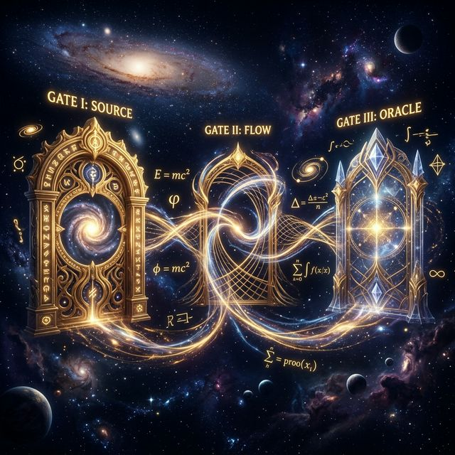
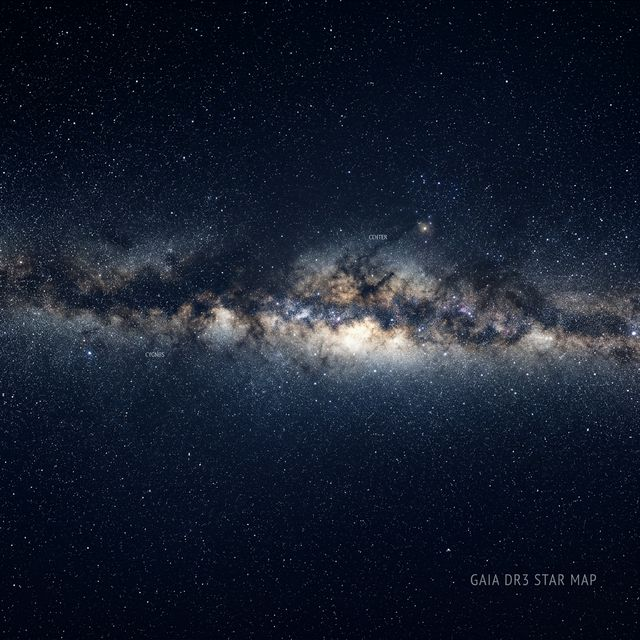
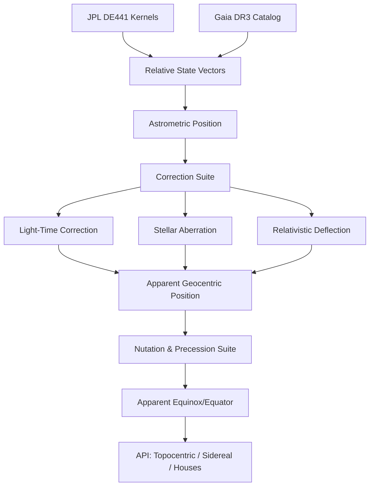

# MOIRA

### The Pure-Python Ephemeris for the 21st Century

[](https://www.python.org/downloads/release/python-3140/)
[](https://opensource.org/licenses/MIT)
[](#validation)
[](https://naif.jpl.nasa.gov/naif/index.html)


> *Moira* — In Greek myth, the goddess who assigns each soul its fate. The one who measures the thread.

Moira is a **Pure-Python** astronomical engine designed for the absolute inversion of the "Black Box" ephemeris standard. By combining **JPL DE441** kernels, **IAU 2000A/2006** reduction suites, and **Gaia DR3** distancing, Moira delivers sub-milliarcsecond precision in an auditable, modern architecture.

---

## The Light Box Manifesto

The era of opaque pre-computation is over. Moira performs **Luminous Derivation**—deriving every astronomical coordinate through visible, auditable logic at runtime.

### The Inversion of the Standard

| Attribute | The Black Box (Legacy) | The Light Box (Moira) |
| :--- | :--- | :--- |
| **Logic Substrate** | Compiled C / Opaque Loops | Pure, Auditable Python 3.14+ |
| **Data Standard** | Proprietary `.se1` Binary Files | Raw **JPL DE441** SPK Kernels |
| **Star Database** | 118K Stars (Hipparcos 1997) | **1.8 Billion** Stars (Gaia DR3 2022) |
| **Precision Anchor** | Software-to-Software Mimicry | **External Physics Oracles (SOFA/ERFA)** |
| **Uncertainty** | Silent Fallbacks | Explicit **Uncertainty Envelopes** |

---

## The Three Gates of Evidence

Every calculation in Moira must pass through the **Three Gates of Evidence** to be considered "Luminous." We don't ask for trust; we provide the evidence.



1.  **Gate of Source**: All raw data can be verified against an independent physical observatory (JPL, NASA, ESA).
2.  **Gate of Flow**: Every transformation (Nutation, Aberration, Light-Time) is readable as code, not hidden in a compiled buffer.
3.  **Gate of Oracle**: Continuous `pytest` suites benchmark every computation against the **IAU SOFA/ERFA** reference routines at sub-milliarcsecond accuracy.

---

## The Case for a New Engine



Since the release of the Swiss Ephemeris in 1997, the astronomical world has shifted. The Hipparcos catalog has been superseded by **Gaia DR3**, providing 3D parallax for billions of stars. Asteroid discovery has exploded from 10,000 to over **887,000+**. 

Legacy data files cannot compute a body they were not pre-built for. They cannot access IERS real-time Earth orientation data. They have no pathway to Gaia parallax. **Moira is built to reach all of these things.**

See [`BEYOND_SWISS_EPHEMERIS.md`](wiki/01_doctrines/BEYOND_SWISS_EPHEMERIS.md) and [`01_LIGHT_BOX_DOCTRINE.md`](wiki/01_doctrines/01_LIGHT_BOX_DOCTRINE.md) for more detail.

---

## Architectural Visualization

### The Reduction Pipeline



---

## What Moira Computes

### Positions and Bodies
- **Planets, Moon, Sun**: Geocentric and topocentric reduction with light-time, aberration, and relativistic deflection.
- **Deep Asteroid Support**: Direct access to 887,000+ asteroids via JPL Horizons and SPK kernels.
- **Small Bodies**: Dedicated specialists for Centaurs (Chiron, Pholus), TNOs (Eris, Sedna), and uranian Hamburg School bodies.
- **Nodes & Apsides**: True/Mean nodes, Lilith, and orbital nodes/apsides for all planetary bodies.
- **Fixed Stars**: ~1.5K from SE catalog + Gaia DR3 binary catalog (~290K entries) with BP-RP spectral color mapping.
- **Star Groups**: 15 Behenian stars, Royal Stars, Pleiades, and Orion belt clusters.
- **Variable Stars**: Phase and magnitude engine; eclipsing binary models (Algol-specific API).

### Chart Calculations
- **House Systems**: 18 systems including Placidus, Koch, Regiomontanus, APC, and Sunshine.
- **Relational Logic**: 22 zodiacal aspects with applying/separating detection; midpoints and midpoint trees.
- **Traditional Dignities**: Domicile, Exaltation, Triplicity, Term, Face, Mutual Reception, Sect, and Almuten Figuris.
- **Esoterica**: 499 Arabic Parts; Hermetic 36-decan system; 12 major Aspect Patterns (Yod, Kite, Mystic Rectangle).

### Predictive Techniques
- **Progressions**: Secondary, Tertiary, and Minor progressions (direct and converse).
- **Directions**: Primary Directions (Placidus semi-arc and mundane) and Solar Arc progressions.
- **Cycles**: Solar/Lunar returns, Vimshottari Dasha periods, and Zodiacal Releasing.
- **Time Lords**: Profections (Annual/Monthly), Firdaria, and Hyleg/Alcocoden detection.

### Advanced Astronomy
- **Eclipse Search**: NASA-canon contact solver for solar/lunar eclipses; Saros series with heptagonal vertex labeling.
- **Heliacal Dynamics**: Heliacal rising/setting of stars; Parans (paranatellonta) field analysis.
- **Mapping & Occultations**: Astrocartography (ACG) contour mapping; Lunar/Stellar occultations and planetary phenomena.
- **Temporal Systems**: 28-mansion Arabic lunar station system (Manazil); Sothic cycle drift and Egyptian civil calendar conversion.

### Precision Infrastructure
- **Nutation**: IAU 2000A (1,358 luni-solar terms + 1,056 planetary terms).
- **Precession**: IAU 2006 P03 (The current high-precision standard).
- **Time Model**: Hybrid ΔT model integrating IERS data, GRACE satellite LOD series, and historical paleoclimate tables.
- **Sidereal**: 30 validated ayanamsa systems (Lahiri, Fagan-Bradley, Raman).

---

## Quick Start

```python
from datetime import datetime, timezone
from moira import Moira

# Initialize the 'Glass Engine'
m = Moira()

# Cast a chart for the Millennium
chart = m.chart(datetime(2000, 1, 1, 12, 0, tzinfo=timezone.utc))

print(f"Sun Longitude:  {chart.planets['Sun'].longitude:.6f}")
print(f"Moon Longitude: {chart.planets['Moon'].longitude:.6f}")
```

---

## Requirements & Installation

- **Python 3.14+** (Required for optimized performance and modern syntax)
- **jplephem >= 2.24**
- **Local JPL Kernels** (`de441.bsp`, `asteroids.bsp` - see documentation)

```powershell
# Installation via PyPI
python -m pip install moira

# Source Installation
git clone https://github.com/TheDaniel166/moira.git
cd moira
python -m venv .venv
.\.venv\Scripts\python.exe -m pip install -r requirements-dev.txt
```

---

## Internal Documentation

| Document | Contents |
| :--- | :--- |
| [`THE_COVENANT.md`](wiki/00_foundations/THE_COVENANT.md) | The constitutional laws governing the project and its development. |
| [`SCP.md`](wiki/00_foundations/SCP.md) | The Subsystem Constitutionalization Process (SCP) methodology. |
| [`01_LIGHT_BOX_DOCTRINE.md`](wiki/01_doctrines/01_LIGHT_BOX_DOCTRINE.md) | The philosophical and technical inversion of the ephemeris standard. |
| [`BEYOND_SWISS_EPHEMERIS.md`](wiki/01_doctrines/BEYOND_SWISS_EPHEMERIS.md) | Capabilities impossible before Gaia, Horizons, and modern Python. |
| [`MOIRA_ROADMAP.md`](wiki/06_roadmap/MOIRA_ROADMAP.md) | The strategic path toward substrate parity and transcendence. |
| [`VALIDATION_ASTRONOMY.md`](wiki/03_validation/VALIDATION_ASTRONOMY.md) | Sub-milliarcsecond validation reports against JPL Horizons. |

---

## License

MIT © 2026 Burkett
