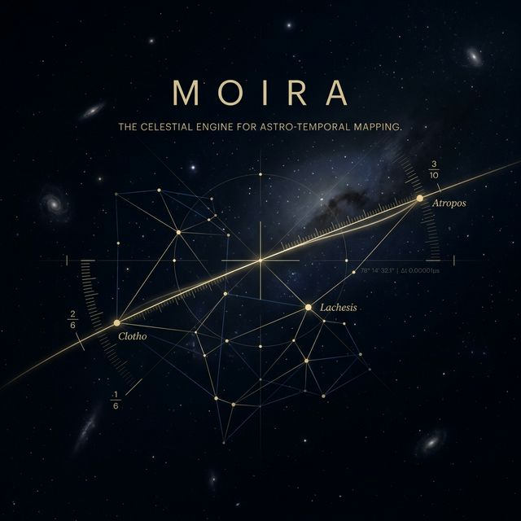
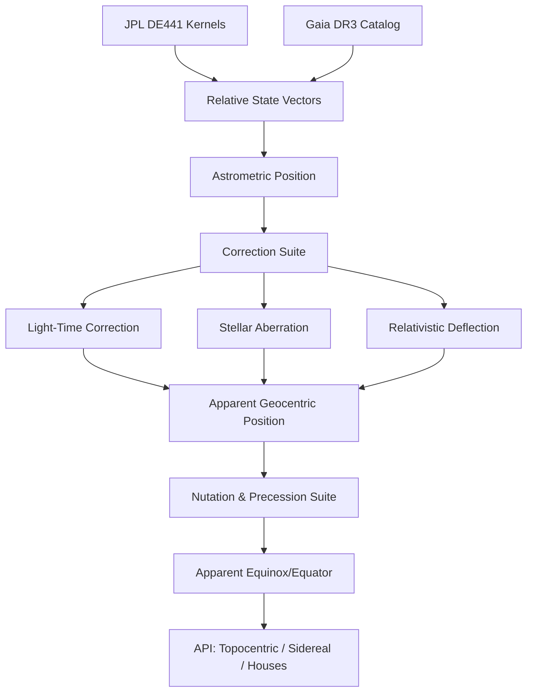

# MOIRA

### A Pure-Python Astronomical Engine — Planets, Stars, Eclipses, and the Full Astrological Stack.

[](https://www.python.org/downloads/)
[](https://opensource.org/licenses/MIT)
[](https://pypi.org/project/moira-astro/)
[](#-validation-evidence)
[](https://naif.jpl.nasa.gov/naif/index.html)
[](#requirements--installation)



> *"Moira" — the goddess who assigns each soul its fate. The one who measures the thread.*

Moira is a **Pure-Python** astronomical and astrological engine built on **JPL DE441** kernels, **IAU 2000A/2006** reduction suites, and **Gaia DR3** stellar data. It delivers the full stack: from celestial mechanics to chart calculation, predictive techniques, and advanced astronomical phenomena — all in auditable, readable Python with zero compiled binaries.

---

## 💎 The Moira Advantage

*   **Auditability**: Every coordinate is derived by code you can read, not a pre-compiled black box.
*   **Precision**: Sub-milliarcsecond accuracy benchmarked against **JPL Horizons** and **IAU ERFA**.
*   **Modernity**: Built for **Gaia DR3** (1.8B stars) and **887,000+** asteroids.
*   **Simplicity**: `pip install moira-astro` and you're ready. Zero C-compiler requirement.

---

## 🔭 What Moira Computes

### 🌍 Positions & Bodies
*   **Planets & Luminaries**: Geocentric and topocentric reduction with light-time, aberration, and relativistic deflection.
*   **Asteroid Fleet**: Built-in support for **887,000+** asteroids. Fetch state vectors from Horizons and package them into local `.bsp` kernels with the integrated `daf_writer`.
*   **Specialist Oracles**: Dedicated engines for **Classical Asteroids** (Ceres, Vesta, etc.), **Centaurs** (Chiron, Pholus, etc.), and **Trans-Neptunians** (Ixion, Quaoar, Varuna, Orcus).
*   **Hypotheticals**: Native Hamburg School engine for the **8 Uranian bodies** (Cupido to Poseidon) plus **Transpluto**.
*   **Fixed Stars**: **100% Sovereign Star Map**. Census of **~1,200 named stars** (via Gaia DR3 Identity Anchors) and **290,000+ deep-sky stars** (G < 10). Includes full proper motion, sub-milliarcsecond parallax, and **Stellar Quality** mapping. *Note: License-independent and benchmarked for ±500 years of J2000.*
*   **Star Groups & Binaries**: 15 Behenian stars, Royal Stars, clusters (Pleiades, Aldebaran), and orbit ephemerides for major binary systems (Sirius AB).
*   **Variable Stars**: Phase and magnitude engine for eclipsing binaries and intrinsic variables (Algol-specific API; LPV support).
*   **Nodes & Apsides**: True/Mean nodes, Lilith, and orbital nodes/apsides for all planetary bodies.

### 📐 Chart Calculation
*   **House Systems**: 19 systems including Placidus, Koch, Regiomontanus, Whole Sign, APC, and Sunshine.
*   **Relational Logic**: 22 zodiacal aspects with applying/separating detection; midpoints and midpoint trees.
*   **Traditional Dignities**: Domicile, Exaltation, Triplicity, Term, Face, Sect, and Almuten Figuris.
*   **Esoterica**: 499 Arabic Parts; Hermetic 36-decan system; 21+ Aspect Pattern detectors (Yod, Grand Cross, Kite, etc.).

### ⏳ Predictive Techniques
*   **Progressions**: Secondary, Tertiary, and Minor progressions (direct and converse).
*   **Directions**: Primary Directions (Placidus semi-arc/mundane) and Solar Arc progressions.
*   **Cycles**: Solar/Lunar returns, Vimshottari Dashas, and Zodiacal Releasing.
*   **Time Lords**: Profections (Annual/Monthly), Firdaria, and Hyleg/Alcocoden detection.

### 🌑 Advanced Astronomy
*   **Eclipse Search**: NASA-canon contact solver for solar/lunar eclipses; Saros series tracking.
*   **Heliacal Dynamics**: Heliacal rising/setting of stars; Parans (paranatellonta) field analysis.
*   **Mapping**: Astrocartography (ACG) contour mapping and Local Space transforms.
*   **Temporal Systems**: 28-mansion Arabic lunar stations (Manazil); Sothic cycle drift and Egyptian civil calendar conversion.

---

## ⚡ Quick Start

```python
from datetime import datetime, timezone
from moira import Moira

# Initialize the 'Light Box'
m = Moira()

# 1. Cast a basic chart
chart = m.chart(datetime(2000, 1, 1, 12, 0, tzinfo=timezone.utc))
print(f"Sun:  {chart.planets['Sun'].longitude:.6f}°")
print(f"Moon: {chart.planets['Moon'].longitude:.6f}°")

# 2. Compute House Cusps (Placidus, London)
from moira import HouseSystem
houses = m.houses(
    datetime(2000, 1, 1, 12, 0, tzinfo=timezone.utc),
    latitude=51.5074, longitude=-0.1278,
    system=HouseSystem.PLACIDUS
)
print(f"ASC: {houses.asc:.4f}° | MC: {houses.mc:.4f}°")

# 3. Detect Aspect Patterns
from moira.patterns import detect_patterns
patterns = detect_patterns(chart)
for p in patterns:
    print(f"Pattern Found: {p.type} involving {p.bodies}")
```

---

## 🛠️ Requirements & Installation

*   **Python 3.10+** (utilizes `dataclasses(slots=True)` and union types)
*   **jplephem >= 2.24** (the only runtime requirement)
*   **JPL Kernel** (`de441.bsp` required for full precision — see docs)

```bash
# Standard install (Pure Python)
pip install moira-astro

# Accelerated install (with optional numpy dependency)
pip install moira-astro[fast]
```

### 📦 The Data Inventory

Moira is a "Glass Engine"—it needs high-precision data kernels to function.

| Layer | Source | Bundled? | Note |
| :--- | :--- | :--- | :--- |
| **Physics Tables** | IAU 2000A/2006 | ✅ **Yes** | 2,414 terms for nutation/precession in pure Python. |
| **Primary Kernels** | JPL (DE441, asteroids) | ❌ **No** | Too large for PyPI (3.3 GB). |
| **Named Stars** | Swiss Ephemeris | ❌ **No** | Requires `sefstars.txt` in `kernels/`. |
| **Gaia Census** | Gaia DR3 | ❌ **No** | Generated via `scripts/download_gaia.py`. |
| **Centaurs** | Moira Native | ✅ **Yes** | `centaurs.bsp` (6 primary bodies) included. |

### Pure Python vs. numpy Performance

Moira is functionally identical with or without numpy. When present, numpy accelerates the 2,414 terms of the IAU 2000A nutation engine.

| | Standard (Pure Python) | Accelerated (`[fast]`) |
| :--- | :--- | :--- |
| **Nutation latency** | ~2.7 ms | **~0.035 ms** |
| **Magnitude** | 1.0x | **~79x faster** |
| **Numeric Drift** | — | < 3×10⁻¹⁶ degrees |

---

## ✅ Validation Evidence

The claims in this README are enforced by continuous `pytest` suites benchmarked against independent physical oracles.

| Report | Verification Source |
| :--- | :--- |
| [`VALIDATION_ASTRONOMY.md`](wiki/03_validation/VALIDATION_ASTRONOMY.md) | **IAU ERFA/SOFA, JPL Horizons, NASA.** Geocentric error: **0.576″** (explained ΔT divergence). |
| [`VALIDATION_ASTROLOGY.md`](wiki/03_validation/VALIDATION_ASTROLOGY.md) | **Swiss Ephemeris, Astro.com, Canonical Doctrines.** Covers houses, ayanamshas, and predictive cycles. |
| [`VALIDATION_EXPERIMENTAL.md`](wiki/03_validation/VALIDATION_EXPERIMENTAL.md) | **Gaia DR3, AAVSO, GCVS, Binary Orbit Ephemerides.** Gaia proper-motion, multiple star systems, variable stars. |

---

## 🕯️ The Light Box Manifesto

The era of opaque pre-computation is over. Legacy engines ship pre-compiled binaries that cannot be audited, with proprietary data formats that cannot be updated without a C compiler. 

**The Power of the Light Box:**
*   **Derivation at Runtime**: Every coordinate is derived from raw data through visible logic.
*   **Explicit Uncertainty**: We move toward showing the error bars in astronomical positions.
*   **Horizon-Ready**: Legacy data files can't compute a body they weren't built for. Moira can reach any body on JPL Horizons via its built-in kernel scribe.

### The Three Gates of Evidence

Calculation in Moira must pass three gates to be considered "Luminous":
1.  **Gate of Source**: Raw data must match an independent physical observatory (JPL/NASA/ESA).
2.  **Gate of Flow**: Every transformation (Nutation, Aberration, etc.) must be readable as code.
3.  **Gate of Oracle**: Results must benchmark against reference routines (ERFA) at sub-milliarcsecond accuracy.

---

## 📐 The Reduction Pipeline



---

## 📖 Project Doctrine

| Document | Contents |
| :--- | :--- |
| [`01_LIGHT_BOX_DOCTRINE.md`](wiki/01_doctrines/01_LIGHT_BOX_DOCTRINE.md) | Philosophical and technical inversion of the ephemeris standard. |
| [`BEYOND_SWISS_EPHEMERIS.md`](wiki/01_doctrines/BEYOND_SWISS_EPHEMERIS.md) | Capabilities impossible before Gaia and modern Python. |
| [`SCP.md`](wiki/00_foundations/SCP.md) | The Subsystem Constitutionalization Process (Development Protocol). |

---

## License

MIT © 2026 Burkett
